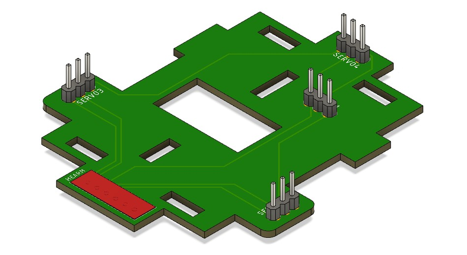

# Me2Arm - open source robot arm, based on MeArm v3.0

> 2020/03/18

Still a work in progress. Details in history. Goal is fork of the MeArm v3.0 with M3 screws and a control board with the blue pill (STM32F103C8T6 - 32bit!). All files should be open source, including the PCBs.

Progress so far:
- 2020/03/18 first PCB soldered, connected
- 2020/03/16 PCB from JLCPCB arrives in Vietnam, and it fits!
- 2020/03/01 PCB ordered

This successful product is used worldwide. Some chinese shops still sell the flawed v0.4 as set cut from 2mm acrylic with all nuts and screws. It's time to upgrade.

## v3.0 from 2018

This edition has many previous issues fixed. It only introduces 2 new problems: 

1. It needs M2.5 screws (thankfully no nuts):
  - 16x 10mm
  - 8x 16mm
  - 16x 6mm
  
2. It needs a PCB for the bottom. The latter one needs to be ordered somewhere else, not with the laser cut, and the gerber file is not yet publicly released.

So I created my own:

## PCB for v3.0

The created file can be ordered at [JLCPCB](https://jlcpcb.com/) and fits. I ordered ... let's see if it fits. The 3D print had to be adjusted, delivery is arriving soon I hope (corona).

Missing files for MeArm v3.0 robot arm

## Vocabulary and abbreviations

- IDC - insulation displacement connector
- PTH - pin through hole
- PH 2.54 - pin header with 0.1" or 2.54mm distance
- FH - female header
- DC3 - not found yet
- boxheader

## Pinout

1. '-' negative
2. '+' plus 5V
3. B - bottom
4. L - left
5. R - right
6. G - gripper
